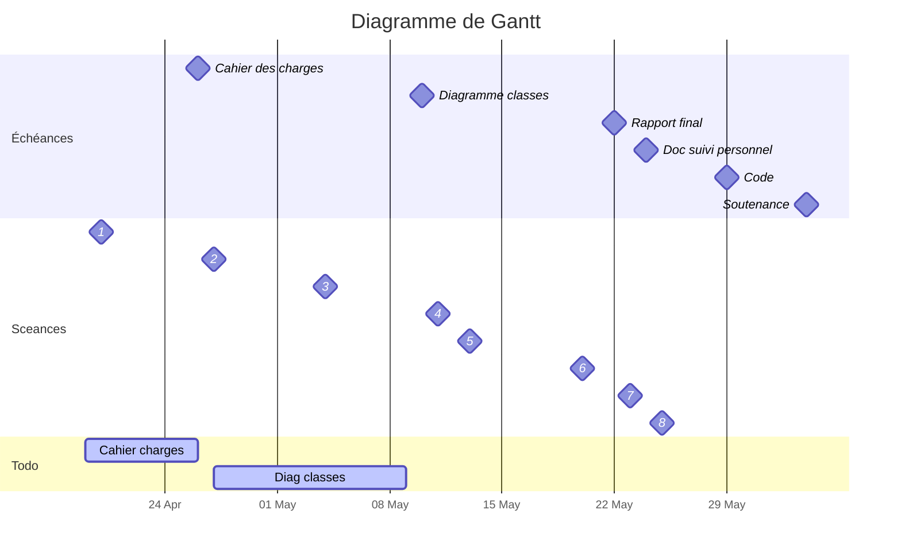

# Projet Info

###### tags `Projet`

:::success
Sujet : Pipeline de traitement de données
Tutrice : Natacha NJONGWA YEPNGA (natachayepnga@gmail.com)
Code source : [GitHub](https://github.com/ludo2ne/Projet-info)
:::

# :dart: Échéances

* Diagramme de classes :clock1: <iframe src="https://free.timeanddate.com/countdown/i83zdl7u/n1264/cf11/cm0/cu2/ct4/cs0/ca0/co0/cr0/ss0/cac009/cpcf00/pcfff/tcfff/fs100/szw256/szh108/iso2022-05-10T23:59:00" allowtransparency="true" frameborder="0" width="105" height="16"></iframe>




---

# :crystal_ball: Pour essayer de comprendre quelque chose au sujet 

* https://scikit-learn.org/stable/ (pour l’idée de l’objectif)
* www.umletino.com/umletino.html (pour import/export UML )
* https://desosa.nl/projects/scikit-learn/2020/03/06/scikit-learn-what-does-it-want-to-be.html (exemple de diagramme de classes avec Pipeline)
* https://fr.acervolima.com/pipelines-python-et-scikit-learn/


### :question: Questions à Giraud 

* Quel est la demande utilisateur ?
    * mettre des fichiers en entrée
    * choisir des transfo
    * lancer le pipeline
    * et récupérer les données propres ?
* Comment l'utilisateur peut-il utiliser l'application ?
    * interface graphique
    * menu de choix dans la console
    * il code du python pour utiliser les classes créées
* Est-ce qu'il faut absolument répondre aux questions du sujet ou c'est simplement une direction à prendre ?


---

# Classes et méthodes


### :large_blue_diamond:  Table

Représente un tableau de données (chargées via un fichier)

* Attributs
    * source :arrow_right: lien vers fichier source
    * noms_colonnes : liste
    * tableau de données (numpy)
    * cle
* Méthodes
    * charger_fichier()


### :large_blue_diamond: Pipeline

Représente une liste de transformation
La méthode lancer prend une table en entrée, applique toutes les Transformations puis retourne la nouvelle table

* Attributs
    * liste[Transformation] (ordonnée)
* Méthodes
    * lancer(Table) :arrow_right: Table


### :large_blue_diamond: Transformation

Classe mère dont hérite toutes les classes ci-dessous

* Attributs
    * Aucun ?
* Méthodes
    * appliquer(Variable)

##### :large_blue_diamond: Selectionner_variables

* Méthodes
    * appliquer(ListeVariables)


##### :large_blue_diamond: Fenetrage

* Méthodes
    * appliquer(Variable, min, max)

##### :large_blue_diamond: Centrage

* Méthodes
    * appliquer(Variable)

##### :large_blue_diamond: Normalisation

##### :large_blue_diamond: Agregation_Spatiale

##### :large_blue_diamond: Supprimer_valeur_manquante


---

# Classes et méthodes - old


### Vecteur

* Attributs
    * liste[caractères]
    * type_donnees
* Methodes
    * get_type_donnees()
    * get_nombre_lignes()
    * contient(string) :arrow_right: Booléen si le la valeur est présente dans le vecteur

##### VecteurCaractere

* Methodes
    * selectionner_valeurs(liste) :arrow_right: pour les variables qualitatives

##### VecteurDate

* Méthodes
    * fenetrer()

##### VecteurNumerique

* Methodes
    * get_min()
    * get_max()
    * get_moyenne()
    * get_ecart_type()
    * get_mediane()
    * centrer()
    * normaliser()
    * fenetrer(min, max) :arrow_right: ne garder que les lignes entre min et max

Pour les méthodes centrer, normaliser, fenetrer, avoir un paramètre qui dit si on écrase les données du vecteur ou si l'on en crée un nouveau

### Table

* Attributs
    * source :arrow_right: lien vers fichier source
    * liste[Vecteurs] :arrow_right: de même longeur
    * cle
* Méthodes
    * afficher() :arrow_right: afficher tableau
    * concatener(autre_table) :arrow_right: ajout de lignes 
    * joindre(autre_table) :arrow_right: ajout de colonnes
    * supprimer_colonne(Vecteur)
    * supprimer_ligne(*Filtre*)
    * selectionner_lignes() :arrow_forward: à définir
    * selectionner_colonnes() :arrow_forward: à définir
    * supprimer_valeurs_manquantes(liste[Vecteur]) :arrow_right: supprimer les individus ayant des valeurs manquantes dans l'un des vecteur de la liste
    * exporter(chemin_fichier, format) :arrow_right: 


### Graphique


##### Nuage de points


# :question: Questions au tuteur

* Fonctionnalité pour ne pas sélectionner les individus ayant des valeurs manquante ?
* Comment comparer les données de deux zones géographiques sur une période donnée si une des régions présente des valeurs manquantes ? (DTW?)
* Doit-on tester nos programmes préférentiellement sur un petit échantillon de données dans un 1er temps ?
* Qu'est-ce qui sous-entendu par agrégation spaciale des régions ? Une simple concaténation des données régionales dans une même table, ou plutôt une table avec des nouvelles données à l'échelle nationale calculées à partir des données régionales.
* Est-ce que le calcul de coefficient de corrélation (ou autre relation) doit faire partie du diagramme d'utilisation ? 

### Questions pratiques

* Quelles sont les fonctionnalités de bases ?
    * charger fichier
    * calculer indicateurs
    * générer fichier sortie


# Questions entre nous

* Fenêtrage
>[color=green][name=JP] L'action de fenêtrage est pour la/les variables horodatées uniquement ? Ou on parle ici de filtrer n'importe quelle variable selon un critère (comme afficher uniquement les données d'une station,  ...)? Dans ce cas, il faudrait ajouter un extends (autre filtrage) à la selection.
>[name=Ludo] je pensais plutot qu'on pouvait filtrer n'importe quel type de variables : valeur min et/ou valeur max pour les quanti - et pour les quali, sélection d'une valeur (ou d'une liste de valeurs)

* Jointure
> [color=green][name=JP] La jointure ne devrait-elle pas être dans un autre menu que sélection (comme sur le diagramme de cas d'utilisation) ? Les deux actions peuvent être faites dans n'importe quel ordre et enregistrées dans une nouvelle table ?
>[name=Ludo] je pense que c'est plus simple et plus intuitif de tout mettre au même endroit, après à voir avec le tuteur
>[name=JP] J'aime bien la formulation proposée par Lau par mail pour ce 1er rendu, puis à voir avec le tuteur éventuellement. On verra après en pratique ce que ça donne.

* création d'une nouvelle variable 
> [color=green][name=JP] ça peut être lourd de créer une nouvelle variable dans la même table si on le fait pour un groupe de variables. est-ce qu'on ne pourrait pas créer une nouvelle table qui remplace la variable par sa variable centrée-réduite ? (comme la normalisation sur R)
> [name=Ludo] c'est pas faux, mais ça parait lourd aussi de recréer à chaque fois une nouvelle table. Une solution pourrait être de mettre ou option (Remplacer l'ancienne variables)
> [name=JP] Bon compromis de proposer l'option de remplacer la variable 

# :bookmark_tabs:  Cahier des charges

:link: [lien vers le **Cahier des charges du cahier des charges**](https://hackmd.io/XCcQyfrETOCeX4pdMb6j_w)

- [ ] <= 5 pages
- [ ] rédiger clairement et proprement (sans blague :smiley: !?) 

Contenu :
- [ ] Contexte et présentation du projet
- [ ] Contraintes liés au projet
- [ ] Résultats attendus (que doit-il se passer lors de l'exécution ? "maquette" de l'application)
- [ ] Description des fonctionnalités qu'on va coder

### Commentaires

- quel support pour le CDC ? Ici ?
    - > [color=green][name=Ludo] PTD_nomEncadrant_Gr_Nom1_Nom2_Nom3.pdf <br> on peut rédiger dans un hackmd ou latex et générer un pdf
- on fait déjà un doc Latex sur lequel on rédige le CDC et on le reprendra pour le rapport ?
- c'est quoi un "papeline" de traitement de données ? (cf page 4 du sujet)
    - > [color=green][name=Ludo]  c'est comme une chaine de montage, tu as des données en entrée, au poste A ça transforme, au poste B ça épure, au poste C ça calcule, au poste D ça met en forme et en sortie t'as des jolies données

**. . . .En fait le "sujet" est déjà un cahier des charges non? On nous demande de paraphraser ?** :shrug: 
- > [color=green][name=Ludo] oui...


### Todo

#### Fonctionnalités

Faire un diagramme de cas d'utilisation

1. Chargement
    * doit fonctionner avec différents types de fichiers (csv, json...)
    * charger fichier csv de lien station météo - région
        * bonus : se brancher directement à l'API
2. Traitement
    * Jointure entre plusieurs jeux de données
3. Restitution
    * Extraction de données
        * au format csv, mais doit permettre d'utiliser d'autres formats à l'avenir
        1. Fenêtrage (sélection temporelle)
        2. Sélection des variables en sortie
        3. Agrégation spatiale (changer granularité régionale vers nationale)
    * Trucs stats 
        * Moyenne glissante (necessite fenetrage)
        * Centrage (necessite selection de variables)
        * Normalisation (necessite selection de variables)
    * Graphiques

---


# :microphone: Discussions et brouillon

> [color=green][name=Laurène] c'est bon les gars, ne faite rien, c'est moi qui fait tout sur ce projet
> [name=Ludo] ok super merci !
> [name=Jean-Phi] ah c cool ! 
> https://scikit-learn.org/stable/ (pour l'idée de l'objectif)
> www.umletino.com/umletino.html (pour import/export UML )
https://desosa.nl/projects/scikit-learn/2020/03/06/scikit-learn-what-does-it-want-to-be.html (exemple de diagramme de classes avec Pipeline)

---

# :dart: Objectifs

* Créer un pipeline de traitement de données
    * entrée : données météo ou électricité pas jolies :poop: (données manquantes...)
    * milieu : 
        * pipeline (liste de transformations)
    * sortie : 
        * csv joli :gem:
        * quelques graphiques (nuages de points, séries temporelle...) avec [Mathplotlib](https://matplotlib.org/)
        * carte (module fourni par le prof)
    * bonus : interroger une API coordonnées-régions
* Refaire un peu comme c'est fait dans R
    * comme si on faisait un package de traitement stats
    * https://fr.wikipedia.org/wiki/Scikit-learn
    * python package panda

---

# :gift: Note & Livrables

Chaque partie compte pour 1/3 de la note finale :
* Rapport
    * entre 15 et 25 pages
    * intro / mise en contexte + developpement + conclusion
        * Liste des fonctionnalités
        * ce qui a été fait / non fait
        * diagrammes UML
            * cas d'utilisation
            * classes (Avec [UMLet](https://www.umlet.com/))
* Soutenance
    * Vendredi 03 juin 09h50 :clock1: <iframe src="https://free.timeanddate.com/countdown/i83zdl7u/n1264/cf11/cm0/cu2/ct4/cs0/ca0/co0/cr0/ss0/cac009/cpcf00/pcfff/tcfff/fs100/szw256/szh108/iso2022-06-03T09:50:00" allowtransparency="true" frameborder="0" width="105" height="16"></iframe>
    * Présentation du projet (10 min)
        * Organisation de l'équipe
    * Démo (10 min)
    * Questions (10 min)
* Code
    * fonctionnel, documenté
    * utiliser héritage
    * découpé en paquets / modules
    * tests unitaires sur un module (1 classe de tests)
    * optionnel : readadoc (documentation automatique du code)


---


# :open_file_folder: Git - paramètrage

* [Git by Donatien](https://donatien26.gitlab.io/website/ensai/projet1A_2021/index.html#/)


### 1. Config Git bash

:::info
Git permet de faciliter la synchronisation du code entre : 
* notre poste : dépôt local (ou personnel)
* GitHub : dépôt distant (ou commun)
:::

Ouvrir git bash et entrer les commandes suivantes (la dernière permet de vérifier)
```bash=
git config --global user.name "Ludovic Deneuville"
git config --global user.email ludovic.deneuville@eleve.ensai.fr
git config -l
```


### 2. Clé SSH

toujours dans Git bash, lancer cette commande et taper ENTREE à chaque question

```bash=
ssh-keygen -t rsa -b 4096 -C "ludovic.deneuville@eleve.ensai.fr"
cat /p/.ssh/id_rsa.pub
```

* La commande cat renvoi tout le contenu de ce fichier.
* Sélectionner ce contenu pour le copier et le garder de côté pour la prochaine étape


### 3. Créer un compte sur GitHub


:::info
GitHub est le site qui permet d'héberger le dépôt distant du code
:::

* https://github.com/
* Aller dans **Settings** (en haut à droite) puis dans **SSH and GPG keys**
    * ou directement ici : https://github.com/settings/keys
* Cliquer sur **New SSH key**
    * title : ma_cle_ensai (en fait mettez ce que vous voulez)
    * key : coller le résultat de l'étape 2
    * Add SSH Key

### 4. Cloner le code

* Créer le dossier suivant **P:\projet-info-sources**
* Dans Git Bash, taper
```bash=
cd P:/projet-info-sources
git clone git@github.com:ludo2ne/Projet-info.git
```

* Are you sure... :arrow_right: taper **yes**
* Et voila le code du projet est importé dans le dossier **P:\projet-info-sources**

---


# :open_file_folder: Git - utilisation

### 1. Avant de commencer à coder

* Ouvrir **Git Bash**
```bash=
cd P:/projet-info-sources/Projet-info
git pull
```

le **git pull** permet d'importer en local toutes les modifications qui auraient pu être faite par les autres depuis la dernière fois

### 2. Je code

* je crée/modifie/supprime des fichiers python
* je teste que ça fonctionne bien
* une fois que j'ai fait un bon morceau qui fonctionne, je crée un commit (point de sauvegarde)

```bash=
git add .                 # permet d'ajouter tous les nouveaux fichiers créés
git status                # pour voir les changements en cours (c'est la commande que l'on utilise le plus)
git commit -am "message explicite"        # Pour creer un commit
```
* Si par la suite je fais une connerie, c'est facile de revenir au commit précédent
:::spoiler
* :warning: cette commande supprime toutes les modifications depuis le dernier commit
    * :bulb: par sécurité, copier/coller le dossier **Projet-info** avant de lancer la commande
```bash=
git reset --hard
```
:::

### 3. Je partage mon oeuvre

* Si les autres n'ont rien foutu entre temps, tout va bien :+1: 
* Par contre si l'un d'eux a modifié le dépôt distant, il faut d'abord synchroniser ton dépôt local avec les modifications effectuées par cet enfoiré avant de partager ton code
* Si vous n'avez pas touché aux mêmes fichiers
    * c'est cool ça va bien se passer :+1: 
* Si vous avez touché au même fichier, c'est là que ça devient drole :face_palm: 
    * :rotating_light: CONFLICT (content): Merge conflict - Automatic merge failed :rotating_light: 
    * il faut ouvrir le fichier en conflit et on voit apparaitre ceci 
```
<<<<<<< HEAD
"Les modifs que j'ai faites"
=======
"Les modifs faites par l'autre con"
>>>>>>>
```
* il ne reste plus qu'à modifier le fichier pour choisir quelle modif on garde
    * puis restester que tout est ok
    * puis recréer un commit `git commit -am "merge manuel a cause de lautre con"`
    * et enfin faire son `git push`


```bash=
git pull           # pour recuperer les eventuelles modifs du depot distant
git status         # pour voir s il n y a pas de conflits
git push           # pousser son code vers depot distant
```

### Commandes - ce qu'il faut retenir

```bash=
git status               # Voir ce qui est en cours
git pull                 # Copier depot distant vers depot local
git push                 # Copier depot local vers depot distant

git add .                # Avant un commit pour que git identifie les nouveaux fichiers
git commit -am "message" # Creer un point de sauvegarde
```


---

### Packages python

* :heavy_check_mark: [numpy](https://courspython.com/apprendre-numpy.html)
* :heavy_check_mark: matplotlib
* :heavy_check_mark: scipy
* :no_entry_sign: :panda_face: Panda interdit 
* demander si besoin d'utiliser d'autres paquets


# Diagramme UML de cas d'utilisation
